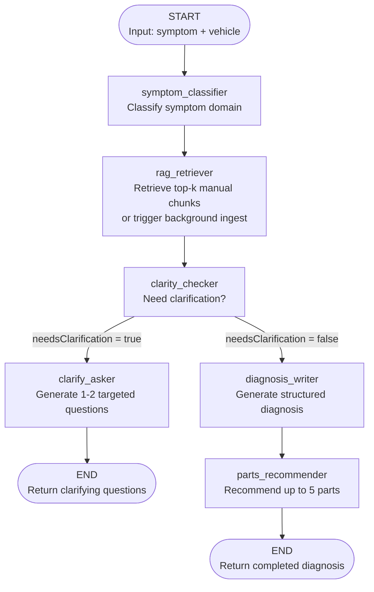

# AutoAdvisor

A full-stack web application that helps drivers diagnose vehicle symptoms using an AI agent backed by real repair manual data.

---

## Wireframe PDF -- Created using Visily
[View PDF Document](wireframes.pdf)

## Storyboard Link and text description -- Written using Figma and ChatGPT

<https://www.figma.com/make/j06khUjDEBl9LWzCaw7dup/AutoAdvisor-Storyboard?fullscreen=1&t=g71LyZ7xgNQolgCk-1&preview-route=%2Fgarage>

### Frame 1 — Login / Register
**Name:** SB-01 Authentication  

**Layout**
- Centered card (400px width)  
- Logo at top  
- Inputs stacked vertically  

**Content**
- Email input  
- Password input  
- Primary button: “Login”  
- Secondary text: “Create Account”  

**Annotation (side note box)**
- User enters credentials → validation occurs  

---

### Frame 2 — Home Dashboard
**Name:** SB-02 Home  

**Layout**
- Left: main content (70%)  
- Right: optional empty space or illustration  

**Content**
- Large CTA card: “Start New Diagnosis”  
- Section title: “Past Diagnoses”  
- List items (cards):
  - Title  
  - Date  
  - Delete icon  

**Empty State Variant**
- Icon + “No diagnoses yet”  

---

### Frame 3 — Vehicle Selection
**Name:** SB-03 Vehicle Select  

**Layout**
- Centered multi-step card  

**Content**
- Dropdowns:
  - Year  
  - Make  
  - Model  
- Divider “OR”  
- VIN input field  
- Saved vehicles (horizontal cards)  

**Validation State**
- Red outline + helper text  

---

### Frame 4 — Symptom Input
**Name:** SB-04 Symptoms  

**Layout**
- Large input-focused layout  

**Content**
- Textarea (primary focus)  
- Placeholder: “Describe your issue…”  
- Mileage input (optional)  
- Submit button  

**Error Variant**
- “Please enter at least 10 characters”  

---

### Frame 5 — Processing
**Name:** SB-05 Processing  

**Layout**
- Centered loading card  

**Content**
- Spinner / progress animation  
- Status text:
  - “Analyzing symptoms…”  
  - “Checking common issues…”  

**Visual Tip**
- Use subtle animated dots or progress bar feel  

---

### Frame 6 — Clarifying Questions
**Name:** SB-06 Clarification  

**Layout**
- Q&A stacked card  

**Content**
- Question 1 (radio buttons or dropdown)  
- Question 2 (optional)  
- Submit button  

**UX Note**
- Keep it minimal — avoid overwhelming the user  

---

### Frame 7 — Diagnosis Results
**Name:** SB-07 Results  

**Layout**
- Card-based dashboard  

**Content**

**Top Section:**
- Urgency badge (e.g., red/yellow/green)  
- Confidence %  

**Main Section:**
- Likely cause (bold headline)  
- Description  

**Expandable Section:**
- Parts list  
- Repair steps (accordion)  

**Bottom Actions:**
- Save  
- Edit & Resubmit  
- New Diagnosis  

---

### Frame 8 — Garage Management
**Name:** SB-08 Garage  

**Layout**
- List view  

**Content**
- Vehicle cards:
  - Name (nickname)  
  - Default tag  
- Actions:
  - Edit  
  - Delete  
- Button: “Add Vehicle”  

---

### Frame 9 — Confirmation Modal
**Name:** SB-09 Modal  

**Layout**
- Center modal overlay  

**Content**
- Title: “Are you sure?”  
- Description text  
- Buttons:
  - Cancel (secondary)  
  - Confirm (danger)  

**Use Cases (duplicate variants)**
- Delete diagnosis  
- Remove vehicle  
- Unsaved changes  

## Resources

### GarageVehicle

A user's saved vehicle in their garage. Stores the vehicle configuration and supports nicknames and a default designation.

| Attribute | Type | Description |
|-----------|------|-------------|
| `_id` | ObjectId | MongoDB document ID |
| `userId` | ObjectId | Reference to the owning User |
| `year` | Number | Model year (required) |
| `make` | String | Manufacturer (required) |
| `model` | String | Model name (required) |
| `trim` | String | Trim/sub-model |
| `engine` | String | Engine configuration |
| `bodyStyle` | String | Body style (sedan, SUV, etc.) |
| `driveType` | String | Drive type (2WD, 4WD, AWD) |
| `nickname` | String | User-assigned label (max 30 chars) |
| `isDefault` | Boolean | Whether this is the user's default vehicle |
| `createdAt` | Date | Auto-generated timestamp |
| `updatedAt` | Date | Auto-generated timestamp |

### Diagnosis

A diagnostic session. Created when a user submits a symptom, updated as the AI agent progresses through classification, clarification, and diagnosis.

| Attribute | Type | Description |
|-----------|------|-------------|
| `_id` | ObjectId | MongoDB document ID |
| `userId` | ObjectId | Reference to User (optional — app works without auth) |
| `vehicleId` | ObjectId | Reference to GarageVehicle (optional) |
| `symptomDescription` | String | User-entered symptom (10–1000 chars, required) |
| `vehicleContext` | Object | Snapshot of `{ year, make, model, trim, engine, mileage }` at diagnosis time |
| `clarifyingQuestions` | [String] | 1–2 questions the agent asked for clarification |
| `clarifyingAnswers` | [String] | User's answers to clarifying questions |
| `diagnosisResult` | Object | Structured diagnosis (see schema below) |
| `ragSourcesUsed` | [Object] | RAG chunks used `{ source, title, score }` |
| `replacementProcesses` | [Object] | Saved step-by-step repair instructions per part |
| `status` | String | One of: `pending`, `clarifying`, `complete`, `error` |
| `createdAt` | Date | Auto-generated timestamp |
| `updatedAt` | Date | Auto-generated timestamp |

### User *(optional — auth track)*

A registered user account. Passwords are hashed with bcrypt.

| Attribute | Type | Description |
|-----------|------|-------------|
| `_id` | ObjectId | MongoDB document ID |
| `username` | String | Unique username (3–30 chars) |
| `email` | String | Unique email address |
| `passwordHash` | String | bcrypt-hashed password (never exposed in JSON) |
| `createdAt` | Date | Auto-generated timestamp |

### ManualChunk

A chunk of vehicle repair manual text with its embedding vector, used for RAG retrieval.

| Attribute | Type | Description |
|-----------|------|-------------|
| `_id` | ObjectId | MongoDB document ID |
| `content` | String | Raw text (~1000 chars) |
| `embedding` | [Number] | Dense vector array (4096 dimensions, qwen3-embedding) |
| `source` | String | URL or file path of the original page |
| `title` | String | Section/page title |
| `category` | String | Repair domain (brakes, engine, transmission, etc.) |
| `vehicle` | Object | `{ make, model, year }` for pre-filtering |

---

## REST API Endpoints

### Vehicles (NHTSA vPIC proxy)

| # | Method | Route | Description |
|---|--------|-------|-------------|
| 1 | `GET` | `/api/vehicles/years` | Returns available model years (1992–current+1) |
| 2 | `GET` | `/api/vehicles/makes` | Returns all passenger-vehicle makes (cached 24h from NHTSA) |
| 3 | `GET` | `/api/vehicles/models?year=&make=` | Returns models for a year + make combination |
| 4 | `GET` | `/api/vehicles/trims?year=&make=&model=` | Returns trim/variant options for a specific vehicle |
| 5 | `GET` | `/api/vehicles/vin/:vin` | Decodes a 17-character VIN via NHTSA vPIC and returns vehicle fields |

### Garage (requires authentication)

| # | Method | Route | Description |
|---|--------|-------|-------------|
| 6 | `GET` | `/api/garage` | List all saved vehicles for the authenticated user |
| 7 | `POST` | `/api/garage` | Save a vehicle to the garage (max 5, duplicate check) |
| 8 | `PUT` | `/api/garage/:id` | Update a vehicle's nickname or default status |
| 9 | `DELETE` | `/api/garage/:id` | Remove a vehicle from the garage |

### Diagnoses

| # | Method | Route | Description |
|---|--------|-------|-------------|
| 10 | `POST` | `/api/diagnoses` | Submit a symptom — triggers the full AI agent workflow |
| 11 | `GET` | `/api/diagnoses` | List all past diagnoses (optionally filter by `?vehicleId=`) |
| 12 | `GET` | `/api/diagnoses/:id` | Get a single diagnosis by ID |
| 13 | `DELETE` | `/api/diagnoses/:id` | Delete a saved diagnosis |
| 14 | `POST` | `/api/diagnoses/:id/followup` | Submit answers to clarifying questions — re-invokes the agent |
| 15 | `POST` | `/api/diagnoses/replacement-process` | Generate step-by-step part replacement instructions |

### Users (optional — auth track)

| # | Method | Route | Description |
|---|--------|-------|-------------|
| 16 | `POST` | `/api/users/register` | Register a new account (bcrypt password hashing) |
| 17 | `POST` | `/api/users/login` | Log in and create a session |
| 18 | `POST` | `/api/users/logout` | Destroy session and clear cookie |
| 19 | `GET` | `/api/users/me` | Get the currently authenticated user |

### RAG

| # | Method | Route | Description |
|---|--------|-------|-------------|
| 20 | `POST` | `/api/rag/ingest` | Ingest raw text into the vector store (chunk + embed + store) |
| 21 | `POST` | `/api/rag/search` | Test vector similarity search |
| 22 | `GET` | `/api/rag/stats` | Get chunk counts by category |
| 23 | `DELETE` | `/api/rag/chunks` | Clear all chunks (optionally filter by `?category=`) |

---

## Data Models & Schema Definitions

### GarageVehicle Schema

```js
const garageVehicleSchema = new Schema({
  userId:     { type: Schema.Types.ObjectId, ref: 'User', required: true, index: true },
  year:       { type: Number, required: true },
  make:       { type: String, required: true, trim: true },
  model:      { type: String, required: true, trim: true },
  trim:       { type: String, trim: true, default: '' },
  engine:     { type: String, trim: true, default: '' },
  bodyStyle:  { type: String, trim: true, default: '' },
  driveType:  { type: String, trim: true, default: '' },
  nickname:   { type: String, trim: true, maxlength: 30, default: '' },
  isDefault:  { type: Boolean, default: false },
}, { timestamps: true });
```

### Diagnosis Schema

```js
const recommendedPartSchema = new Schema({
  partName:      { type: String, required: true },
  partCategory:  { type: String, required: true },
  oemPartNumber: { type: String },
  causationProbability: { type: Number, min: 0, max: 100, default: 50 },
}, { _id: false });

const diagnosisResultSchema = new Schema({
  likelyCause:      { type: String, required: true },
  confidenceLevel:  { type: String, enum: ['high', 'medium', 'low'], required: true },
  recommendedParts: [recommendedPartSchema],
  repairDifficulty: { type: String, enum: ['DIY-Easy', 'DIY-Moderate', 'Shop-Recommended'] },
  urgency:          { type: String, enum: ['Drive carefully', 'Fix soon', 'Stop driving'] },
  additionalNotes:  { type: String },
}, { _id: false });

const replacementProcessSchema = new Schema({
  partName:      { type: String, required: true },
  steps:         [{ type: String }],
  tools:         [{ type: String }],
  estimatedTime: { type: String },
  difficulty:    { type: String },
  warnings:      [{ type: String }],
}, { _id: false });

const diagnosisSchema = new Schema({
  userId:              { type: Schema.Types.ObjectId, ref: 'User', index: true },
  vehicleId:           { type: Schema.Types.ObjectId, ref: 'GarageVehicle' },
  symptomDescription:  { type: String, required: true, minlength: 10, maxlength: 1000 },
  vehicleContext:      { year: Number, make: String, model: String, trim: String, engine: String, mileage: Number },
  clarifyingQuestions:  [{ type: String }],
  clarifyingAnswers:    [{ type: String }],
  diagnosisResult:      diagnosisResultSchema,
  ragSourcesUsed:       [{ source: String, title: String, score: Number }],
  replacementProcesses: [replacementProcessSchema],
  status:               { type: String, enum: ['pending', 'clarifying', 'complete', 'error'], default: 'pending' },
}, { timestamps: true });
```

### User Schema

```js
const userSchema = new Schema({
  username:     { type: String, required: true, unique: true, trim: true, minlength: 3, maxlength: 30 },
  email:        { type: String, required: true, unique: true, lowercase: true, trim: true },
  passwordHash: { type: String, required: true },
}, { timestamps: true });
```

### ManualChunk Schema

```js
const manualChunkSchema = new Schema({
  content:   { type: String, required: true },
  embedding: { type: [Number], required: true },
  source:    { type: String, default: '' },
  title:     { type: String, default: '' },
  category:  { type: String, default: 'general' },
  vehicle:   { make: { type: String, default: '' }, model: { type: String, default: '' }, year: { type: String, default: '' } },
}, { timestamps: true });
```

---

## Agentic AI Workflow

### Overview

The diagnostic agent is implemented using **LangGraph** (Node.js). It is invoked when a user submits a symptom via `POST /api/diagnoses`. The agent takes a symptom description and vehicle context as input, routes through classification, RAG retrieval, clarity checking, and diagnosis generation, and outputs a structured `diagnosisResult`.

The agent uses **Retrieval-Augmented Generation (RAG)** to ground its responses in actual service manual content rather than relying solely on LLM parametric memory.

### Agent Graph



### Node Descriptions

| # | Node | Type | Description |
|---|------|------|-------------|
| 1 | `symptom_classifier` | LLM | Categorizes the symptom into a repair domain (brakes, engine, transmission, electrical, etc.) |
| 2 | `rag_retriever` | Tool | Checks if RAG data exists for this vehicle. If yes, embeds the query and retrieves top-5 relevant manual chunks via cosine similarity. If no data exists, triggers background ingestion for future requests. |
| 3 | `clarity_checker` | LLM | Evaluates whether the symptom description contains enough detail for a confident diagnosis, or if clarifying questions are needed. |
| 4a | `clarify_asker` | LLM | Generates 1–2 targeted clarifying questions for the user. The graph ends here and returns to the client. When the user answers, a new agent run is initiated with the answers pre-populated, skipping this path. |
| 4b | `diagnosis_writer` | LLM + RAG | Produces a structured diagnosis including likely cause, confidence level, repair difficulty, urgency, and notes. Injects RAG context when available. |
| 5 | `parts_recommender` | LLM | Recommends up to 5 replacement parts with categories and causation probabilities. |

### Edges

| From | To | Type | Condition |
|------|----|------|-----------|
| START | `symptom_classifier` | Static | Always |
| `symptom_classifier` | `rag_retriever` | Static | Always |
| `rag_retriever` | `clarity_checker` | Static | Always |
| `clarity_checker` | `clarify_asker` OR `diagnosis_writer` | **Conditional** | `routeAfterClarityCheck()` — routes based on `state.needsClarification` |
| `clarify_asker` | END | Static | Always (returns questions to user) |
| `diagnosis_writer` | `parts_recommender` | Static | Always |
| `parts_recommender` | END | Static | Always |

### Routing Function

```js
function routeAfterClarityCheck(state) {
  if (state.needsClarification) return 'clarify_asker';
  return 'diagnosis_writer';
}
```

### Tools

| Tool | Schema | Description |
|------|--------|-------------|
| `ragRetrieveTool` | `{ query, vehicleContext, category?, topK?, minScore? }` (Zod) | Retrieves top-k relevant repair manual chunks for a symptom and vehicle context using embedding cosine similarity with configurable minimum score threshold. |
| `lazyLoadVehicleDataTool` | `{ vehicleContext }` (Zod) | Triggers non-blocking background ingestion for a vehicle if its repair manual data has not been indexed yet. Crawls charm.li, downloads ZIP archives, extracts text, chunks, embeds, and stores in MongoDB. |

### Agent State

```js
const AgentState = Annotation.Root({
  // Inputs
  symptomDescription: Annotation({ ... }),
  vehicleContext:     Annotation({ ... }),
  clarifyingAnswers:  Annotation({ ... }),
  // Intermediate
  symptomCategory:      Annotation({ ... }),
  ragContext:            Annotation({ ... }),
  needsClarification:   Annotation({ ... }),
  clarifyingQuestions:   Annotation({ ... }),
  // Output
  diagnosisResult: Annotation({ ... }),
  ragSourcesUsed:  Annotation({ ... }),
  ragAvailable:    Annotation({ ... }),
});
```

---

## RAG Pipeline

AutoAdvisor uses **Retrieval-Augmented Generation (RAG)** to ground the AI's diagnoses in actual service manual content rather than relying solely on the LLM's training data.

### Ingestion

```
charm.li (service manuals)
        │
        ▼
   Crawl / Download ZIP
        │
        ▼
   Extract raw text
        │
        ▼
   Split into ~1000-char chunks
   (200-char overlap between chunks)
        │
        ▼
   Generate embedding vector per chunk
   (Ollama — qwen3-embedding model)
        │
        ▼
   Store in MongoDB (ManualChunk collection)
```

**Two ingestion modes:**

1. **Batch ingestion** (`RAG/ingest.js`) — CLI tool to crawl and ingest entire makes, years, or individual vehicles.
2. **Lazy background ingestion** (`server/rag/backgroundIngest.js`) — When a user diagnoses a vehicle with no existing data, the system automatically fetches and ingests that vehicle's manuals in the background.

### Retrieval

When the `rag_retriever` node runs:

1. Check if the vehicle has data in MongoDB
2. If no data → trigger background ingestion, skip RAG for this request
3. If data exists → embed the query using the same model, pre-filter by vehicle/category, score all candidates by cosine similarity, return top 5 chunks scoring ≥ 0.3
4. Inject retrieved chunks into the LLM prompt as context

### Hallucination Guardrails

- When no RAG data is available, the LLM is explicitly instructed not to fabricate specific part numbers or transmission codes
- A post-processing regex strips any hallucinated transmission codes from the output

---

## Tech Stack

| Layer | Technology |
|-------|------------|
| Frontend | Vue.js 3 (Composition API, CDN), Vue Router |
| Backend | Node.js, Express.js |
| AI Agent | LangGraph (JS), LangChain.js |
| LLM | Ollama — `gpt-oss:20b` |
| Embeddings | Ollama — `qwen3-embedding` |
| Database | MongoDB with Mongoose ODM |
| Auth | `express-session` + `connect-mongo`, `bcrypt` |
| External API | NHTSA vPIC (vehicle data) |
| RAG Source | charm.li (vehicle repair manuals) |
