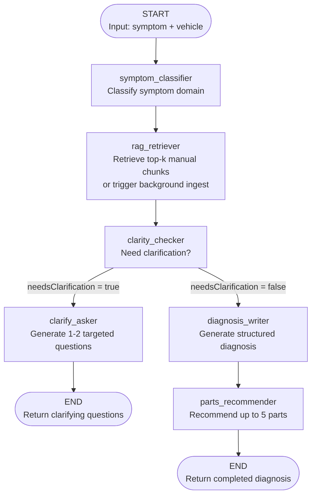

# AutoAdvisor Agent Graph Diagram

This document describes the diagnostic agent state machine with explicit nodes and edges.

## Visual Diagram (Mermaid)



## Node Definitions

| Node | Purpose | Input State Fields | Output State Fields |
|------|---------|--------------------|---------------------|
| `symptom_classifier` | Categorize symptom into domain | `symptomDescription`, `vehicleContext` | `symptomCategory` |
| `rag_retriever` | Gather relevant RAG context, or trigger lazy ingest | `symptomDescription`, `symptomCategory`, `vehicleContext` | `ragContext`, `ragSourcesUsed`, `ragAvailable` |
| `clarity_checker` | Decide if additional user info is needed | `symptomDescription`, `vehicleContext`, `symptomCategory`, `clarifyingAnswers` | `needsClarification` |
| `clarify_asker` | Produce 1-2 follow-up questions | `symptomDescription`, `vehicleContext`, `symptomCategory` | `clarifyingQuestions` |
| `diagnosis_writer` | Produce structured diagnosis object | `symptomDescription`, `vehicleContext`, `symptomCategory`, `ragContext`, `clarifyingAnswers` | `diagnosisResult` |
| `parts_recommender` | Add recommended parts to diagnosis | `diagnosisResult`, `vehicleContext`, `symptomCategory` | `diagnosisResult.recommendedParts` |

## Edge Definitions

| From | To | Edge Type | Condition |
|------|----|-----------|-----------|
| START | `symptom_classifier` | Static | Always |
| `symptom_classifier` | `rag_retriever` | Static | Always |
| `rag_retriever` | `clarity_checker` | Static | Always |
| `clarity_checker` | `clarify_asker` | Conditional | `needsClarification === true` |
| `clarity_checker` | `diagnosis_writer` | Conditional | `needsClarification === false` |
| `clarify_asker` | END | Static | Always |
| `diagnosis_writer` | `parts_recommender` | Static | Always |
| `parts_recommender` | END | Static | Always |

## Routing Function

```js
function routeAfterClarityCheck(state) {
  if (state.needsClarification) return 'clarify_asker';
  return 'diagnosis_writer';
}
```

## State Transition Summary

1. User submits symptom and vehicle context.
2. Agent classifies the symptom domain.
3. Agent attempts RAG retrieval for that vehicle/category.
4. Agent determines whether clarification is needed.
5. If clarification is needed, graph ends with questions for user input.
6. Otherwise, agent writes diagnosis and recommends parts.
7. Graph ends with a complete structured diagnosis payload.

## Tooling Used by the Graph

- `ragRetrieveTool` with schema: `{ query, vehicleContext, category?, topK?, minScore? }`
- `lazyLoadVehicleDataTool` with schema: `{ vehicleContext }`

These tools support retrieval and autonomous background ingestion behavior.
